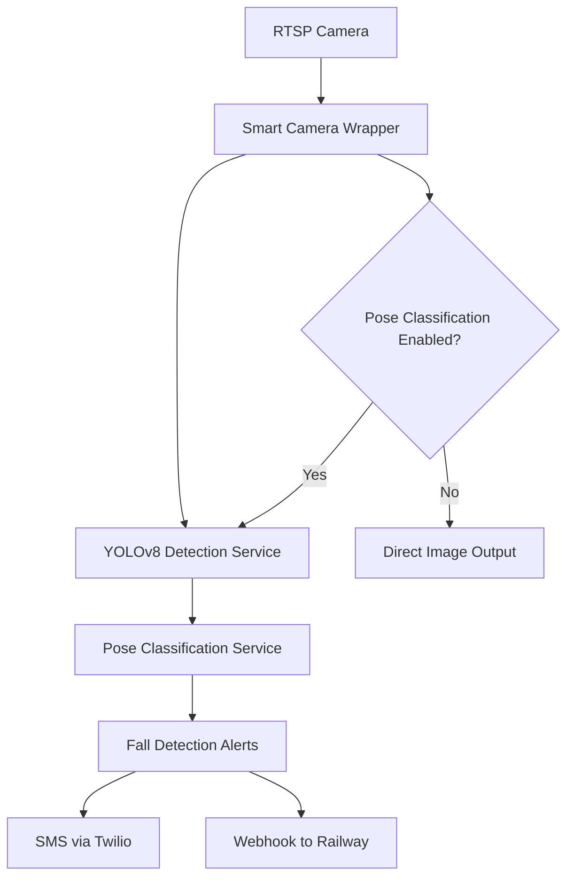

# Rig Guardian Modular Architecture

## 🏗️ Architecture Overview

The Rig Guardian fall detection system has been restructured from a monolithic architecture to a **modular micro-services architecture** with the following benefits:

- **Scalability**: Support for 5-6 RTSP cameras with individual configuration
- **Flexibility**: Enable/disable pose classification and fall alerts per camera
- **Maintainability**: Separate concerns into dedicated services
- **Performance**: Independent scaling and resource management
- **Reliability**: Service isolation prevents cascading failures

## 📦 Module Structure

```
modules/
├── yolov8-detection/     # YOLOv8 pose detection service
├── pose-classifier/      # Pose classification + fall alerts
└── smart-camera/         # Smart camera wrapper with per-camera config
```

### 1. YOLOv8 Detection Service (`yolov8-detection/`)

**Purpose**: Pure YOLOv8 pose detection without classification or alerts

**Features**:
- YOLOv8-pose model inference
- Human pose keypoint detection
- Bounding box detection
- GPU/CPU acceleration
- Configurable confidence thresholds

**API**: `rdk:service:vision`
**Model**: `rig-guardian:yolov8n-pose:yolov8n-detection`

**Configuration**:
```json
{
  "model_location": "yolov8n-pose.pt",
  "confidence_threshold": 0.5,
  "device": "cuda"
}
```

### 2. Pose Classification Service (`pose-classifier/`)

**Purpose**: Pose classification with fall detection and alert system

**Features**:
- ML pose classification (standing, sitting, fallen)
- Fall detection with configurable thresholds
- SMS alerts via Twilio
- Webhook alerts to Railway server
- Per-camera alert configuration
- Alert cooldown management

**API**: `rdk:service:generic`
**Model**: `rig-guardian:pose-classifier:pose-classifier`

**Configuration**:
```json
{
  "pose_classifier_path": "./pose_classifier.joblib",
  "fall_confidence_threshold": 0.7,
  "alert_cooldown_seconds": 300,
  "railway_webhook_url": "https://building-sensor-platform-production.up.railway.app/webhook/fall-alert"
}
```

**Commands**:
- `classify_poses`: Process YOLOv8 detections and classify poses
- `register_camera`: Register camera for fall detection
- `get_status`: Get service status

### 3. Smart Camera Wrapper (`smart-camera/`)

**Purpose**: Wraps RTSP cameras with intelligent pose detection capabilities

**Features**:
- RTSP camera integration
- Configurable pose detection per camera
- Fall alert enable/disable per camera
- Location-based camera identification
- Detection overlay rendering
- Per-camera confidence thresholds

**API**: `rdk:component:camera`
**Model**: `rig-guardian:smart-camera:smart-camera`

**Configuration**:
```json
{
  "rtsp_camera_name": "rtsp-cam-1",
  "location": "Living Room",
  "enable_pose_classification": true,
  "enable_fall_alerts": true,
  "fall_confidence_threshold": 0.7,
  "detection_confidence_threshold": 0.5
}
```

## 🔧 Deployment Configuration

The updated `viam_config_ml.json` configures all services:

### Modules (3)
1. **yolov8n-pose** (registry): YOLOv8 detection
2. **pose-classifier** (local): Pose classification + alerts
3. **smart-camera** (local): Smart camera wrapper

### Services (2)
1. **yolo-detector**: Vision service for pose detection
2. **pose-classifier-service**: Generic service for classification

### Components (12)
- **6 RTSP cameras**: Physical camera connections
- **6 Smart cameras**: Intelligent camera wrappers

## 📹 Camera Configuration Matrix

| Camera | Location | RTSP Stream | Pose Classification | Fall Alerts | Notes |
|--------|----------|-------------|-------------------|-------------|-------|
| rtsp-cam-1 | Living Room | rtsp://192.168.1.100 | ✅ | ✅ | Main monitoring area |
| rtsp-cam-2 | Kitchen | rtsp://192.168.1.101 | ✅ | ✅ | High-risk area |
| rtsp-cam-3 | Bedroom | rtsp://192.168.1.102 | ✅ | ✅ | Private area monitoring |
| rtsp-cam-4 | Hallway | rtsp://192.168.1.103 | ✅ | ✅ | Transit monitoring |
| rtsp-cam-5 | Front Porch | rtsp://192.168.1.104 | ❌ | ❌ | Security only |
| rtsp-cam-6 | Back Yard | rtsp://192.168.1.105 | ❌ | ❌ | Security only |

## 🚀 Service Communication Flow



## ⚙️ Configuration Management

### Per-Camera Settings
Each smart camera can be individually configured:

```json
{
  "location": "Living Room",
  "enable_pose_classification": true,
  "enable_fall_alerts": true,
  "fall_confidence_threshold": 0.7,
  "detection_confidence_threshold": 0.5
}
```

### Global Settings
Fall detection service maintains global settings:

```json
{
  "fall_confidence_threshold": 0.7,
  "alert_cooldown_seconds": 300,
  "railway_webhook_url": "...",
  "twilio_account_sid": "...",
  "twilio_auth_token": "...",
  "twilio_phone_number": "..."
}
```

## 🔄 Migration from Monolithic

### Before (Monolithic)
- Single `yolov8n-pose` module
- All functionality in one service
- Hard-coded fall detection
- Single camera support

### After (Modular)
- Three separate modules
- Dedicated responsibilities
- Configurable per camera
- Multi-camera support
- Independent scaling

## 🛠️ Development Workflow

### Local Testing
```bash
# Test individual modules
cd modules/yolov8-detection
python main.py

cd modules/pose-classifier  
python main.py

cd modules/smart-camera
python main.py
```

### Viam Registry Deployment
```bash
# Deploy each module to Viam Registry
viam module upload --module-id rig-guardian:yolov8n-detection modules/yolov8-detection/
viam module upload --module-id rig-guardian:pose-classifier modules/pose-classifier/
viam module upload --module-id rig-guardian:smart-camera modules/smart-camera/
```

### Configuration Update
1. Update `viam_config_ml.json` with new module references
2. Deploy configuration to robot
3. Verify all services start successfully
4. Test camera-by-camera functionality

## 📊 Benefits Achieved

### ✅ Scalability
- Support for 6 cameras (expandable)
- Independent per-camera configuration
- Resource isolation

### ✅ Flexibility  
- Enable/disable features per camera
- Different confidence thresholds per location
- Modular deployment options

### ✅ Maintainability
- Clear separation of concerns
- Independent module updates
- Easier debugging and testing

### ✅ Performance
- Service-specific resource allocation
- Parallel processing capabilities
- Reduced memory footprint per service

### ✅ Reliability
- Service isolation prevents failures
- Independent restart capabilities
- Better error handling and recovery

## 🔧 Next Steps

1. **Test each module independently**
2. **Deploy to Viam Registry**
3. **Update robot configuration**  
4. **Configure per-camera settings**
5. **Verify fall detection alerts**
6. **Monitor system performance**
7. **Add additional cameras as needed**

## 📝 Notes

- All webhook integration functionality is preserved in the pose classification service
- SMS alerts continue to work through the centralized alert system
- Railway server integration remains unchanged
- Per-camera location identification is now built-in
- Alert cooldown prevents spam while maintaining responsiveness

The modular architecture provides a robust foundation for scaling your fall detection system while maintaining all existing functionality.
